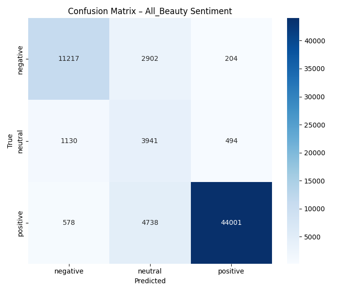

# Sentiment Analysis on Customer Reviews  
**Task 1.2 – Development Phase**  
**IU DLBDSEAI502**  

This repository contains the **complete source code and documentation** for the **Development phase** of Task 1.2: Sentiment analysis of customer reviews.

The task required building a production-ready 3-class sentiment classifier (negative / neutral / positive) on real-world Amazon beauty product reviews using modern NLP techniques.

### Final Model Performance (Validation Set – 69,205 reviews)

| Metric              | Value     |
|---------------------|-----------|
| Accuracy            | **85.48 %** |
| Macro F1            | **0.740** |
| Weighted F1         | **0.874** |
| Eval Loss           | 0.492     |

#### Detailed Classification Report

| Class     | Precision | Recall | F1-score | Support  |
|-----------|-----------|--------|----------|----------|
| negative  | 0.87      | 0.78   | 0.82     | 14,323   |
| neutral   | 0.34      | 0.71   | 0.46     | 5,565    |
| positive  | 0.98      | 0.89   | 0.94     | 49,317   |
| **accuracy** |           |        | **0.85** | 69,205   |
| **macro avg** | 0.73     | 0.79   | **0.74** | 69,205   |
| **weighted avg** | 0.91  | 0.85   | **0.87** | 69,205   |



### Project Highlights
- DistilBERT fine-tuned with SST-2 weight transfer
- Custom WeightedTrainer + class-weighted loss
- Training: 3 epochs, effective batch size 512, ~6 hours on Kaggle T4
- Streamlit demo app 


### Run the Demo
```bash
pip install -r requirements.txt
streamlit run app/streamlit_app.py